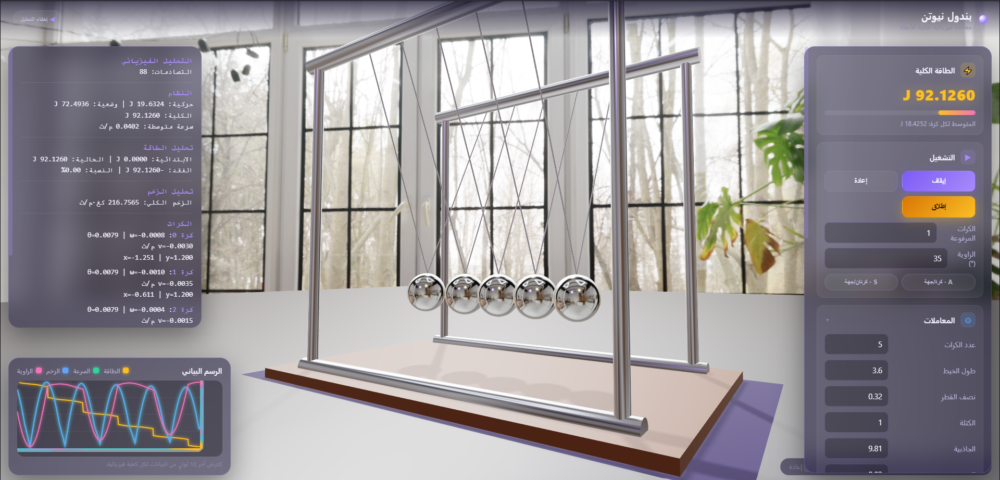
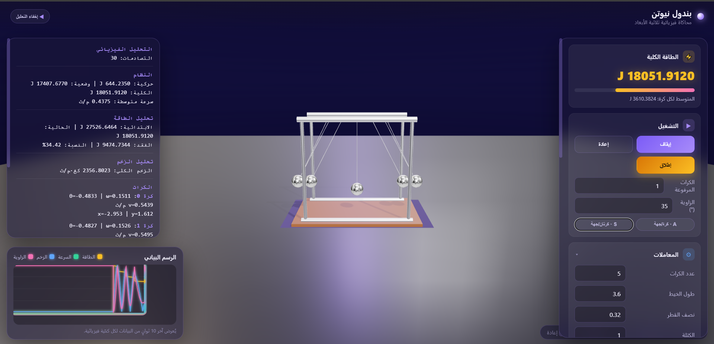

# Comprehensive Physical Study of Newton's Cradle

An advanced computational physics engine and 3D visualization platform designed to simulate, analyze, and study the chaotic and deterministic dynamics of Newton's Cradle. This project pairs complex collision mechanics with real-time interactive rendering to provide deep physical insights.

## 📸 Screenshots

Here is the simulation environment and data rendering workspace in action:

<p align="center">
  
</p>

<p align="center">
  
</p>

---

## 🚀 Key Features

- **Advanced Physics Core:** Implements custom `CollisionSolver` and sub-stepping `Integrator` algorithms for precise momentum and kinetic energy conservation.
- **Real-time 3D Rendering:** Interactive camera management, dynamic lighting, and physical material responses utilizing a performance-optimized graphics pipeline.
- **Live Analytics & UI:** A dedicated `DebugPanel` and `GraphManager` to track structural state transitions, phase-space trajectories, and energy loss over time.
- **Extensible Architecture:** Modular system configuration utilizing factory patterns (`CradleFactory`) and custom utilities for automated data export (`DataExporter`).

---

## 🛠️ Project Structure

The project environment is structured as follows:

- **`src/core/`** – Main simulation loop, engine mechanics, and clock timing controllers (`Engine.js`, `Time.js`).
- **`src/physics/`** – Mathematical core handling collision resolution, structural constraints, and numerical integrators.
- **`src/rendering/`** – High-fidelity visual components, scene setups, lighting configurations, and material assets.
- **`src/ui/`** – Analytical dashboards, live telemetry rendering, and system control panels.
- **`src/components/`** – Declarative UI structures managing individual pendulums and group bindings.

---

## 💻 Tech Stack

- **Language:** JavaScript (ES6+)
- **Framework / Environment:** Node.js, WebGL-focused rendering ecosystem
- **Utilities:** Custom numerical math modules and real-time canvas instrumentation

---

## 🔧 Installation & Local Setup

To clone and run this project locally, follow these steps:

1. **Clone the repository:**
   ```bash
   git clone [https://github.com/Newtons-Cradle-Study/Newtons-Cradle-Study.git](https://github.com/Newtons-Cradle-Study/Newtons-Cradle-Study.git)
   1.Navigate into the directory:
      cd Newtons-Cradle-Study
   2.Install development dependencies:
      npm install
   3Launch the development server:
      npm start
   ```

📊Automated Data Exporting
The platform includes built-in telemetry capturing tools (DataExporter.js) allowing users to dump frame-by-frame mechanical metrics, phase angles, and conservation records straight to CSV/JSON files for external scientific modeling.

---

### 📥 طريقة الرفع بعد ما تلصقه وتحفظه:

افتح الـ Terminal عندك، وانسخ هدول الأسطر لتحديث الملف على جيتهوب فوراً:

```cmd
git add .
git commit -m "docs: restore and finalize comprehensive README with correct screenshot paths"
git push origin main
```
